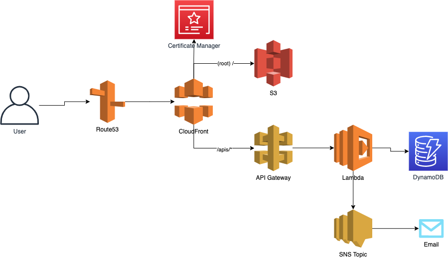

# Host Static Site with AWS and Serverless Framework
This application creates various AWS resources to host a Single Page Application. The application also has a Contact Form to save the contact data into database and also send out email to the author of the application.

AWS Services used in this application.

* S3 - For Hosting
* CloudFront - For CDN
* Route53 - For DNS
* Certificate Manager - For HTTPS certificate
* API Gateway - For API
* Lambda - For Saving Contact Form Data
* DynamoDB - For Database
* SNS - For Sending Email to Author when someone submits contact message

### Route53 Domain Name Configuration
For this demo I am using my Namecheap domain name routed to Amazon Route53 so that I can use the HTTPS certification without extra fuss. You can follow this link to configure the Namecheap to Route53 redirection and ACM for the SSL certificate. 

https://benjamincongdon.me/blog/2017/06/13/How-to-Deploy-a-Secure-Static-Site-to-AWS-with-S3-and-CloudFront/

### Deployment
Before you deploy, create the `config.dev.json` from the `sample.config.json` file and set the values. 

```
{
    "BUCKET_NAME": "S3 bucket name. For example, mysite.com",
    "TABLE_NAME": "DynamoDB table name",
    "CONTACT_RECEIVED_TOPIC": "contact-received-email",
    "FORWARD_EMAIL": "Email where you want to receive contact message",
    "ACM_CERT_ARN": "arn:aws:acm:us-east-1:<AWS ACCOUNT>:certificate/<CERTIFICATION ID>",
    "HOSTED_ZONE_ID": "Route53 Hosted Zone ID" 
}
```

Run the `sls deploy` command to deploy the changes to AWS.

### Site Content Publish

To push the Site specific changes (Html, CSS, JS etc)

```
aws s3 sync app/ s3://<bucket name>
```

### CloudFront Cache Invalidation 
After deploying the service, if you are just pushing the change to your site. The CloudFront distribution will take some time update the cached content. To immediately update the CloudFront, you will need to `invalidate` the cache. 

Go to your CloudFront console and copy the Distribution ID created through this service and run the following command. Please note that the following command will clear the whole cache. You can clear the selective files using `--paths` as well. 

```
aws cloudfront create-invalidation --distribution-id <ID> --paths /*
```

For more detail check the documentation here - https://docs.aws.amazon.com/AmazonCloudFront/latest/DeveloperGuide/Invalidation.html

### SNS Email Subscription
When someone fillup the contact form in the UI. The API will save the data to DynamoDB and also publish a message in the configured SNS Topic. The SNS Topic also has an Email subscription, where you can put the email where you want to receive the message detail. 

After you deploy the service, you will receive the confirmation email from AWS to activate your subscription. Please follow the instructions in the email. 

For more detail check the documentation here - https://docs.aws.amazon.com/sns/latest/dg/sns-email-notifications.html

### Clean up
Clear the Site bucket content first.

```
aws s3 rm s3://<bucket name> --recursive
```

Remove the application stack

```
sls remove --profile <your profile> --aws-region <region>
```

### License 

MIT License

Copyright (c) 2021 Dhaval Nagar